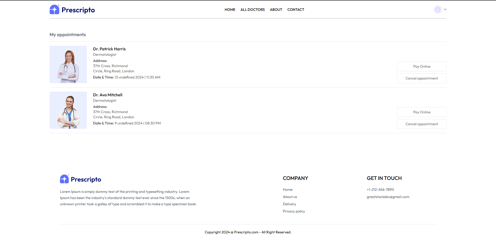

# Prescripto - Doctor Appointment Booking Web Application

Welcome to **Prescripto**, a full-stack web application designed to simplify the process of booking doctor appointments. Built with the MERN stack (MongoDB, Express, React, Node.js), Prescripto offers a seamless experience for patients, doctors, and administrators. 

## Table of Contents
- [Features](#features)
- [Tech Stack](#tech-stack)
- [Visual Overview](#visual-overview)
- [Getting Started](#getting-started)
- [Contributing](#contributing)
- [License](#license)
- [Contact](#contact)

## Features

### Role-based Access
- **Patients**: 
  - Book appointments with trusted doctors.
  - View and manage personal information.
  - Access health records and appointment history.
  
- **Doctors**: 
  - Manage schedules and view upcoming appointments.
  - Track earnings and patient feedback.
  
- **Admins**: 
  - Oversee doctor profiles and appointment management.
  - Ensure the overall system runs smoothly.

### Online Payment Integration
- Integrated with **Razorpay** and **Stripe** for secure and efficient payment processing during appointment bookings.

### Responsive Design
- Fully responsive interface ensuring a seamless experience on all devices, from desktops to mobile phones.

### Secure Authentication
- Utilizes **JSON Web Tokens (JWT)** for secure login functionality for all users.

### User-Friendly Interface
- Intuitive navigation and user-friendly design for a smooth user experience.

### Appointment Management
- Easy management of appointments, including booking, rescheduling, and cancellation.

### Notifications
- Real-time notifications for appointment confirmations, reminders, and updates.

## Tech Stack
- **Frontend**: React.js
- **Backend**: Node.js, Express.js
- **Database**: MongoDB
- **Payment Gateways**: Razorpay, Stripe
- **Authentication**: JSON Web Tokens (JWT)

## Visual Overview

*Homepage showcasing the appointment booking feature.*
***


*Doctor's Dashboard for Viewing Earnings and Managing Appointments.*
***


*Doctor's profile page with available slots.*
***


*User  profile page for managing personal information.*
***


*Appointment history page displaying past appointments.*
***

*Admin's dashboard for managing appointments and doctors.*
***

## Getting Started

To run this project locally, follow these steps:

### Prerequisites
- Node.js (v14 or higher)
- MongoDB (local or cloud instance)
- A code editor (e.g., Visual Studio Code)

### Setup Backend
1. Navigate to the backend directory:
```bash
cd backend
```
2. Install dependencies:
```bash
npm install
```
3. Create a .env file in the backend directory and add the following variables:
```javascript
MONGODB_URI=your_mongodb_connection_string
JWT_SECRET=your_jwt_secret
RAZORPAY_KEY_ID=your_razorpay_key_id
RAZORPAY_KEY_SECRET=your_razorpay_key_secret
STRIPE_SECRET_KEY=your_stripe_secret_key
```
4. Start the backend server:
```bash
npm run server
```
### Setup Frontend
1. Navigate to the frontend directory:
```bash
cd ../frontend
```
2. Install dependencies:
```bash
npm install
```
3. Start the frontend application:
```bash
npm run dev
```
## Contributing
We welcome contributions from the community! To contribute to Prescripto, please follow these steps:

1. Fork the repository.
2. Create a new branch (git checkout -b feature/YourFeature).
3. Make your changes and commit them (git commit -m 'Add some feature').
4. Push to the branch (git push origin feature/YourFeature).
5. Open a pull request.
6. Please ensure your code adheres to the project's coding standards and includes appropriate tests.

## License
This project is licensed under the MIT License. See the LICENSE file for details.

## Contact
For any inquiries or feedback, please reach out to us at mansiraghav05@gmail.com.

Thank you for your interest in Prescripto! We hope you find this project useful and look forward to your contributions. If you have any questions or suggestions, feel free to reach out!
